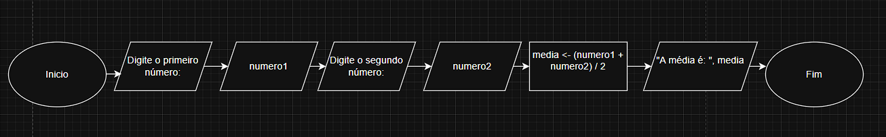

# 2. Formas de Representação de Algoritmos

Um algoritmo, em sua essência, é uma ideia ou plano lógico. Para trabalhar com essa ideia, precisamos representá-la de forma concreta e compreensível. Existem três formas principais de representação, cada uma com vantagens e desvantagens.

---

## 2.1 Descrição Narrativa

É a forma mais simples e intuitiva: descreve os passos usando a linguagem natural (Português), como se explicasse para outra pessoa.

- **Vantagem:** Fácil de criar para problemas simples, não exige conhecimento técnico.
- **Desvantagem:** Propensa a **ambiguidades**. O que é claro para uma pessoa pode ser confuso para outra. Não é precisa para problemas complexos.

**Exemplo: Algoritmo "CalcularMedia" em descrição narrativa**

> "Primeiro, o programa deve pedir para o usuário digitar o primeiro número e guardar esse valor. Depois, ele deve pedir o segundo número e também guardá-lo. Em seguida, o programa deve somar os dois números e dividir o resultado por dois para encontrar a média. Por fim, ele deve mostrar o resultado da média na tela."

---

## 2.2 Fluxograma

O fluxograma é a representação **visual** de um algoritmo. Utiliza símbolos geométricos padronizados para cada tipo de ação (processamento, decisão, entrada de dados, etc.) e setas para mostrar o fluxo da lógica.

- **Vantagem:** Excelente para visualizar o fluxo de controle, especialmente onde há muitas decisões e caminhos diferentes. Facilita o entendimento para pessoas não técnicas.
- **Desvantagem:** Pode ficar muito grande e complexo para algoritmos longos, dificultando a criação e manutenção.

**Símbolos comuns do fluxograma:**

| Símbolo             | Nome           | Descrição                                                                           |
| :------------------ | :------------- | :---------------------------------------------------------------------------------- |
| **Oval**            | Terminal       | Indica o **Início** ou **Fim** do algoritmo.                                        |
| **Paralelogramo**   | Entrada/Saída  | Recebimento de dados (`Leia`) ou exibição de resultados (`Escreva`).                |
| **Retângulo**       | Processamento  | Cálculo ou atribuição de valor (ex: `media <- (n1 + n2) / 2`).                      |
| **Losango**         | Decisão        | Condição (`Se...Então`) que divide o fluxo em dois ou mais caminhos.                |
| **Seta**            | Linha de Fluxo | Conecta os símbolos e indica a ordem de execução.                                   |

**Exemplo: Fluxograma do Algoritmo "CalcularMedia"**

> [!TIP]
> Use ferramentas como **[diagrams.net](https://app.diagrams.net/)** (antigo draw.io) para criar fluxogramas.



---

## 2.3 Portugol (Pseudocódigo Padronizado)

O Portugol é a forma de pseudocódigo mais utilizada no ensino de algoritmos no Brasil. Ele é estruturado, próximo de uma linguagem real, mas ainda legível para quem está começando.

- **Vantagem:** Estruturado, preciso e sem ambiguidades. É a ponte perfeita para a codificação final.
- **Desvantagem:** Exige aprender suas palavras-chave e regras de estruturação.

**Exemplo: Algoritmo "CalcularMedia" em Portugol**

```portugol
algoritmo "CalcularMedia"
var
  numero1: inteiro
  numero2: inteiro
  media: real
inicio
  escreva("Digite o primeiro número: ")
  leia(numero1)
  escreva("Digite o segundo número: ")
  leia(numero2)
  media <- (numero1 + numero2) / 2
  escreva("A média é: ", media)
fimalgoritmo
```

---

## Resumo

- **Descrição narrativa:** Fácil, mas ambígua.
- **Fluxograma:** Visual, ótimo para lógica, mas pode ser complexo.
- **Portugol:** Estruturado, claro e próximo da programação real.

> [!TIP]
> Sempre escolha a forma de representação mais adequada ao seu objetivo e ao público!
